Exploring Put Premiums from Historical Data

    R = S_T/S_0, K = K/S_0

Premiums calculated for each period and vol quantile:

    C_{eu}(K|Q_{vol}) = E[e^-rT (R-K)+|Q_{vol}]
    P_{eu}(K|Q_{vol}) = E[e^-rT (K-R)+|Q_{vol}]

Each return has its own risk free rate, so separate discount applied to each point, instead of appluing single discount
to aggregated premium.

### Estimating Mean E[R]

Estimating from historicaly realised

    observed = exp(mmean_t2 + 0.5*scalep_t2^2)
    mmean    = model(period, vol | P)
    P ~ min L2[weight (log mmean - log observed)]

Positive scale used, to avoid inflating mean by negative skew, although effect is minimal.

Loss is weighted, to make errors equal across vols and periods.

1 and 9 vol deciles boost, as they look to be well shaped. As a side effect, the model underestimates mean at
long >730d periods, it's desired, because the dataset has survivorship bias.

Vol decile 10 ignored, it's too noisy. As result model understimates mean for 10 vol decile, it's desired.

Longer periods have slightly lower weight, because they calculated with overlapping step 30d.

    weight = 1/period^2/vol^0.5
    weight[vol_dc in (1, 9)] *= 1.5

Found params: [-0.0011, 0.0075, 0.0427, 3.2455, 0.0037, -0.0043], loss: 1.1690

### Estimating Scale[R]

Estimating from historicaly realised

    scale = model(period, vol | P)
    P ~ min L2[weight(scale - scale_t2)]

Loss is weighted, to make errors equal across vols and periods.

Longer periods have slightly lower weight, because they calculated with overlapping step 30d.

    weight = 1/scale_t2/period^0.5

Found params: [-0.5207, 1.9198, 1.2038, -0.1444, 0.2549, 0.0000, 0.0000, -0.0349, -0.0437], loss: 1.6550

### Mean E[R | T, vol]

![Mean E[R], by period and vol (model - solid lines)](readme/mean-e-r-by-period-and-vol-model-solid-lines.png)

![Mean E[R]](readme/mean-e-r.png)

### Scale[R | T, vol]

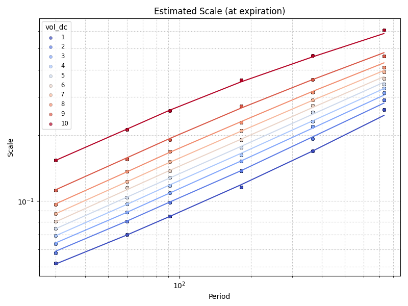

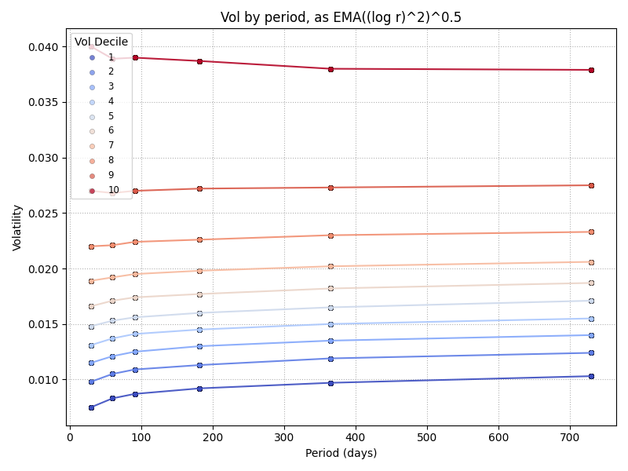

### Strike normalisation

    mmean = predict_mmean(period, vol | P)
    scale = predict_scale(period, vol | P)
    loc = log mmean - 0.5*scale^2
    m = (log(K) - loc)/scale

Compared to true normalised strike

    m_true = (log(K) - mean_t2) / scale_t2

Normalising strike using mean, scale is biased as doesn't account for the distribution shape (skew, tails). But
should be consistent across periods and volatilities, as distribution should be similar.

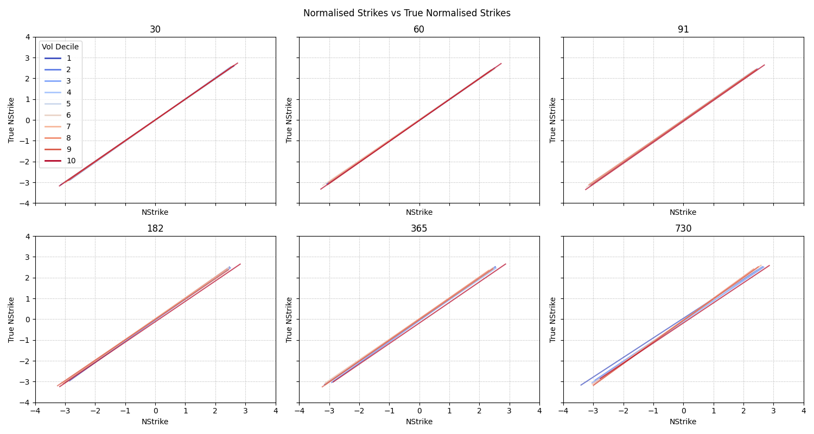

### Premium

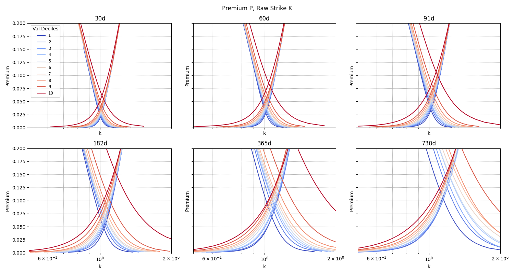

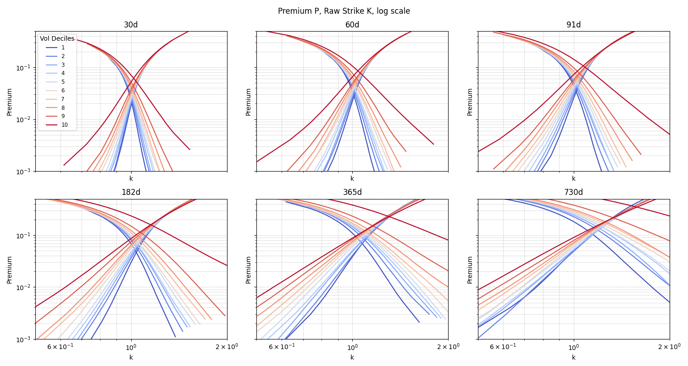

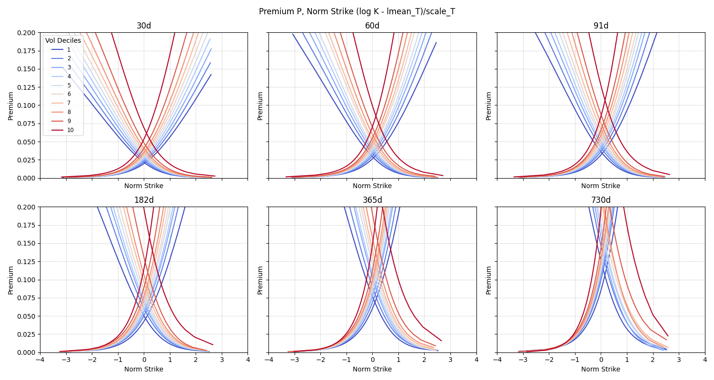

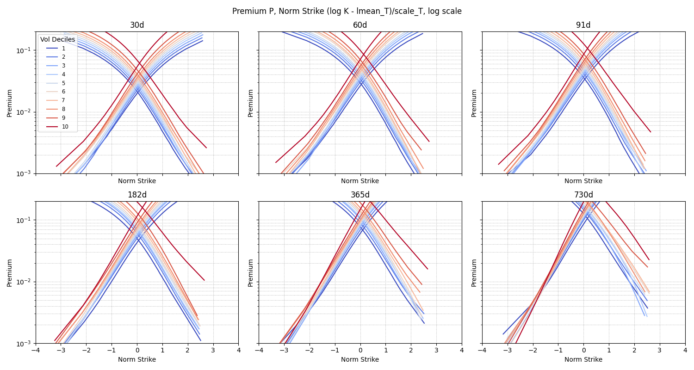

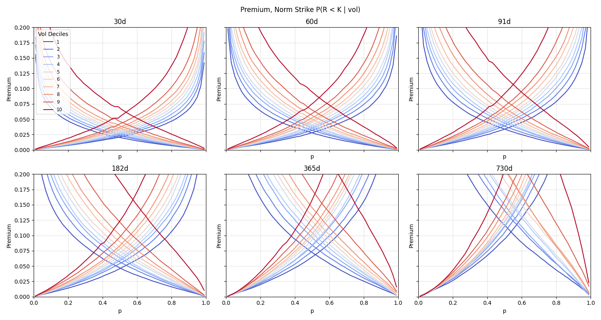

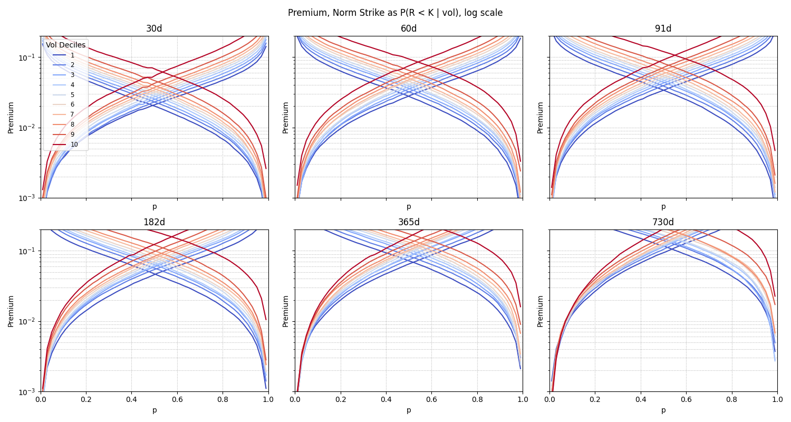

### Norm Premium

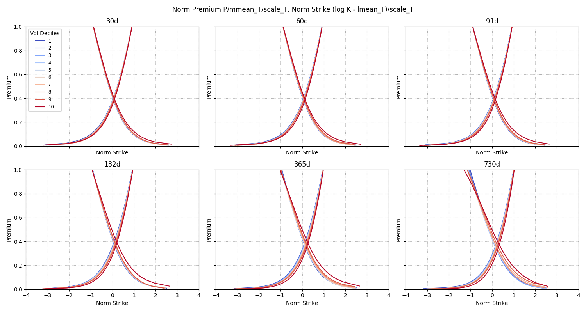

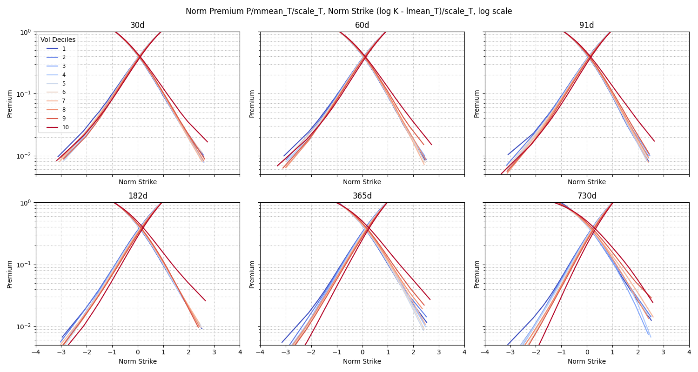

![Norm Premium P/E[R]/Scale[R], Norm Strike P(R < K | vol)](readme/norm-premium-p-e-r-scale-r-norm-strike-p-r-k-vol.png)

![Norm Premium P/E[R]/Scale[R], Norm Strik P(R < K | vol), log scale](readme/norm-premium-p-e-r-scale-r-norm-strik-p-r-k-vol-log-scale.png)

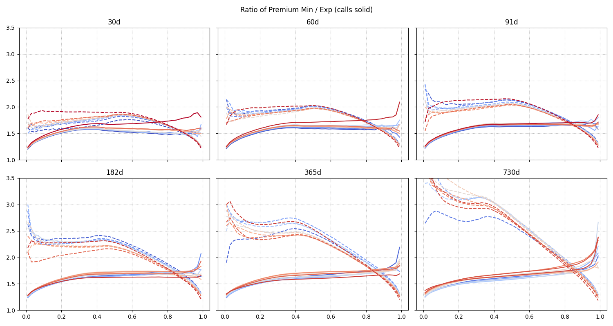

#note bounds for american call: eu < am < 2eu

### Skew

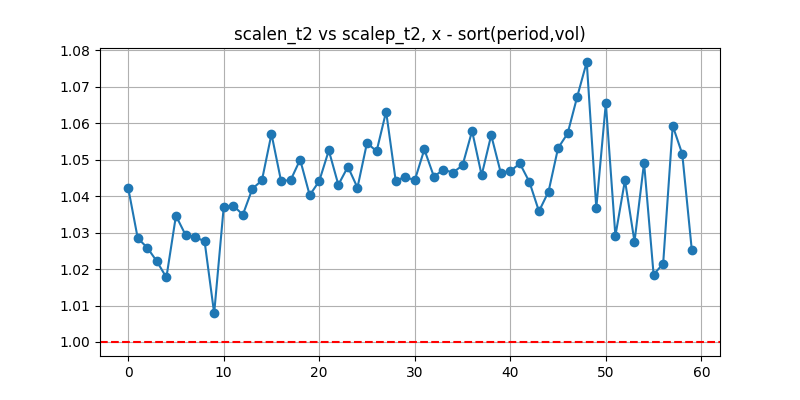

![MMean E[R] with scale vs scalep, x - sort(period,vol)](readme/mmean-e-r-with-scale-vs-scalep-x-sort-period-vol.png)

### Data

    - period - period, days

    - vol_dc - volatility decile 1..10
    - vol    - current moving daily volatility, as EWA(log(r)^2)^0.5, (scale unit, not variance), median of vol_dc group.

    - lmean_t2  - mean[log R]
    - scale_t2  - mean_abs_dev(log R - lmean_t2) * sqrt(pi/2)

    - k  - strike
    - kq - strike quantile

    - p_exp - realised put premium using price at expiration (lower bound, european option)
    - p_max - realised put premium, using min price during option lifetime (upper bound, max possible
      for american option).
    - p_itm - realised probability of put ITM

    - c_exp - realised call premium using price at expiration (lower bound, european option)
    - c_max - realised call premium, using max price during option lifetime (upper bound, max possible
      for american option).
    - c_itm - realised probability of call ITM

Daily prices for 250 stocks all starting from 1973 till 2025, stats aggregated with moving window with step 30d, so
larger periods have overlapping. Dividends ignored. Data has survivorship bias, no bankrupts.

Data adjusted by adding bankrupts. The **annual bankruptsy probability** conditional on company volatility with total
annual rate P(b|T=365) = 0.5% to drop to x0.1.

