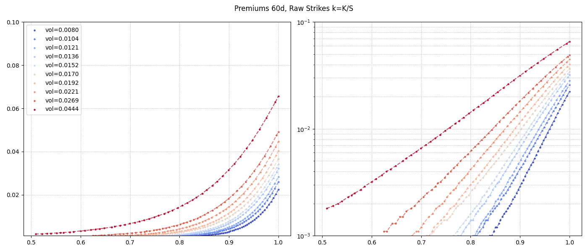
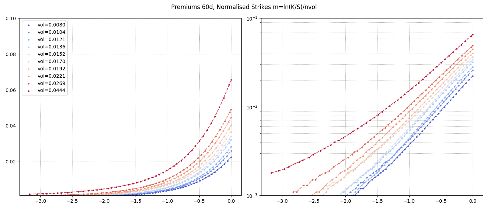
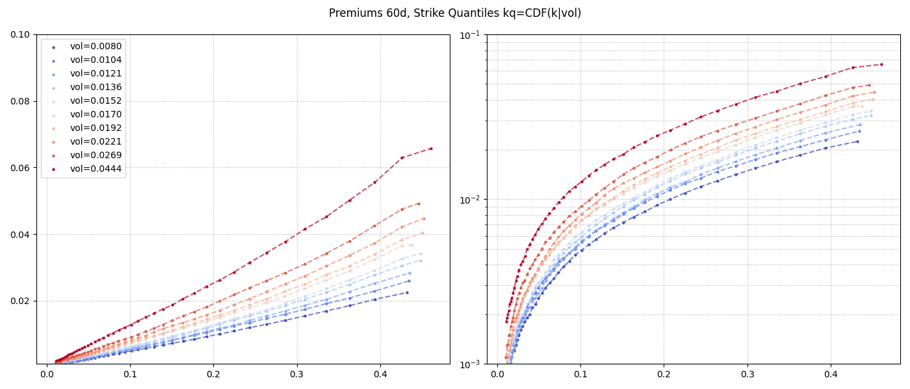

Fitting Premiums for OTM Put from Historical Data.

Data, csv file:

    - period - period, days
    - vol - current volatility as std (in scale unit, not variance).
    - vol_dc - volatility decile 1..10
    - k - strike
    - kq - quantile or strike
    - p_exp - realised put premium using price at expiration (lower bound, european option)
    - p_min - realised put premium, using min price during option lifetime (upper bound, max possible
    for american option).

### Strike normalisation

Strikes normalised so that mad(m) = 1 for all periods.

    m = log(k)/vol_p(vol, period | P)
    vol_p(vol, period | P) = exp(p1 + p2*log(vol) + p3*log(vol)^2)
    P ~ min L2 mean_abs_dev(m) - 1

### Puts 60d

Premiums 60d, Raw Strikes k=K/S

Premiums 60d, Normalised Strikes m=ln(K/S)/nvol

Premiums 60d, Strike Quantiles kq=CDF(k|vol)

#note quantiles produce linear curves

### Exp vs Min for 60d Puts

