Exploring Put Premiums from Historical Data

Premiums calculated as:

    P_{eu}(K|Q_{vol}) = E[(K/S_T-S_T/S_0)^+|Q_{vol}]

### Strike normalisation

Making mad(m) = 1 for all periods.

    m = log(k)/(vol*vol_p(period | P))
    vol_p(period | P) = exp(p1 + p2*log(period) + p3*log(period)^2)
    P ~ min L2 mean_abs_dev(m) - 1

Found params: 0.0008, 0.3840, 0.0007

### Premium normalisation

Making mean premium for k=1 same as 30d period mean.

    np_exp = p_exp / (period/30)**pow
    pow ~ min mean(p_exp|k=1,period) - mean(p_exp|k=1,period=30d)

Found pow: 0.2969

### Puts 60d

Premiums 60d, Raw Strikes k=K/S

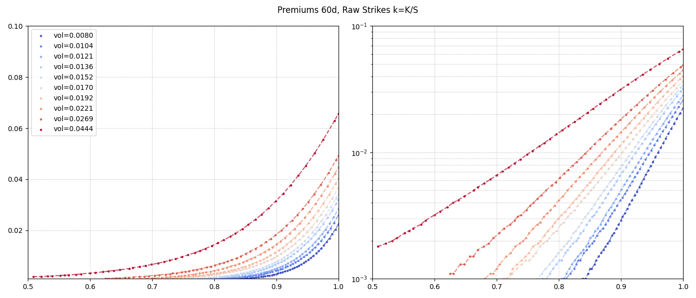

Premiums 60d, Normalised Strikes m=ln(K/S)/nvol

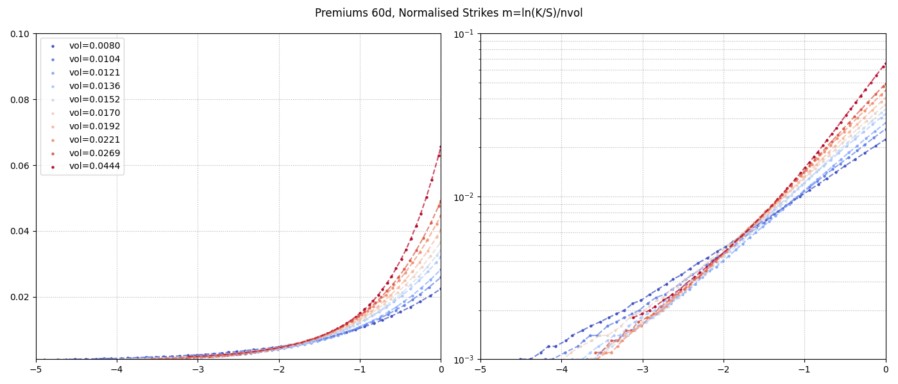

Premiums 60d, Strike Quantiles kq=CDF(k|vol)

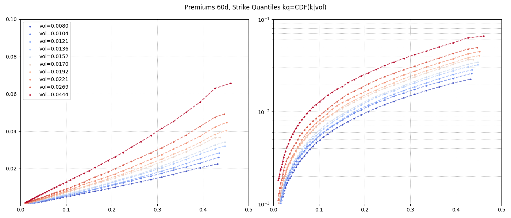

#note quantiles produce linear curves

Premiums 60d, Norma Strikes and Norm Premium

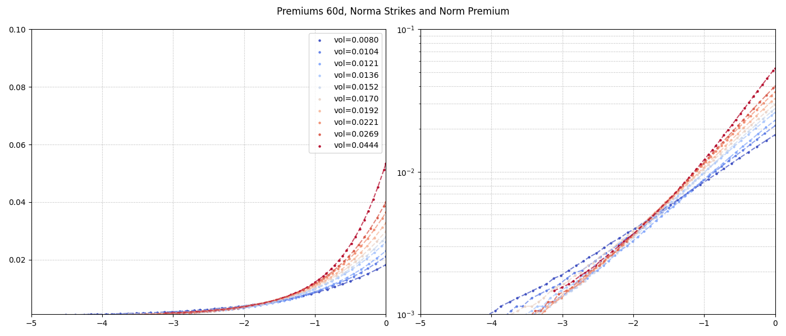

Ratio of Premium Min / Exp, 60d

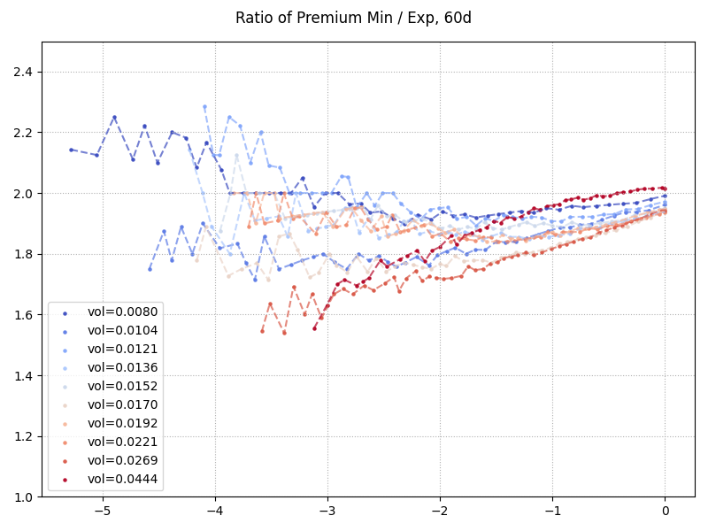

#note bounds for american put: eu < am < 2eu

### Puts all periods

Premiums, Raw Strikes k=K/S (lin)

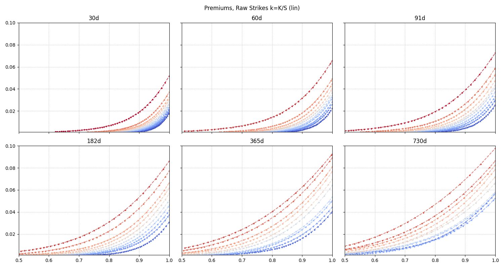

Premiums, Raw Strikes k=K/S (log)

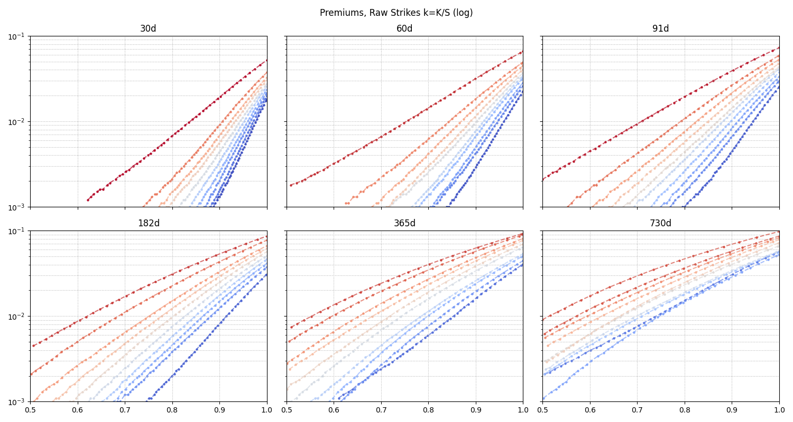

Premiums, Norm Strikes m=ln(K/S)/nvol (lin)

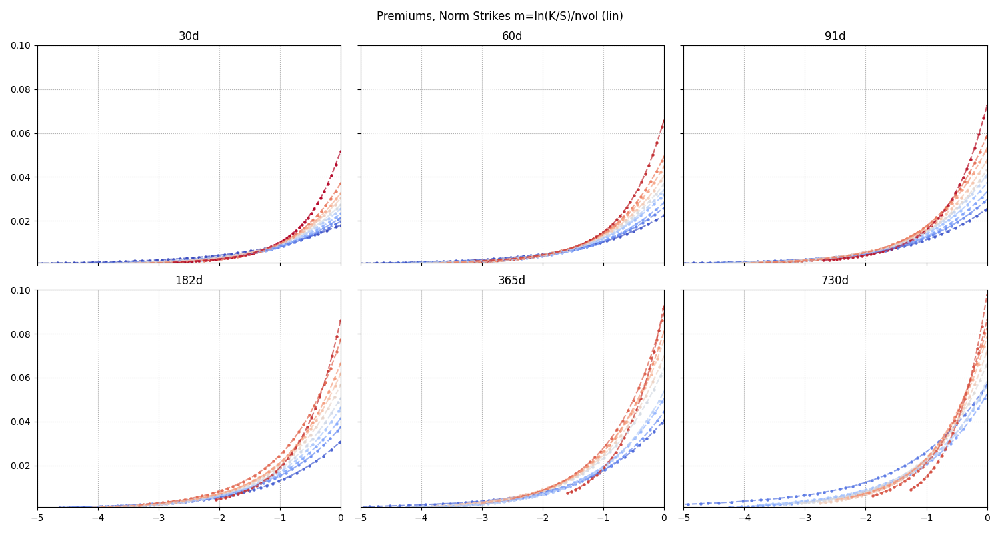

Premiums, Norm Strikes m=ln(K/S)/nvol (log)

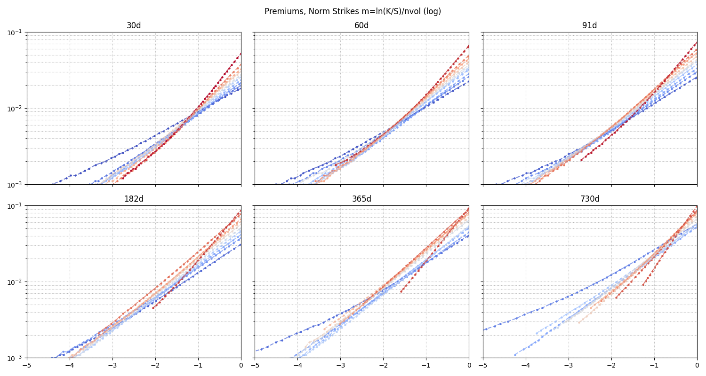

Premiums, Strike Quantiles kq=CDF(k|vol) (lin)

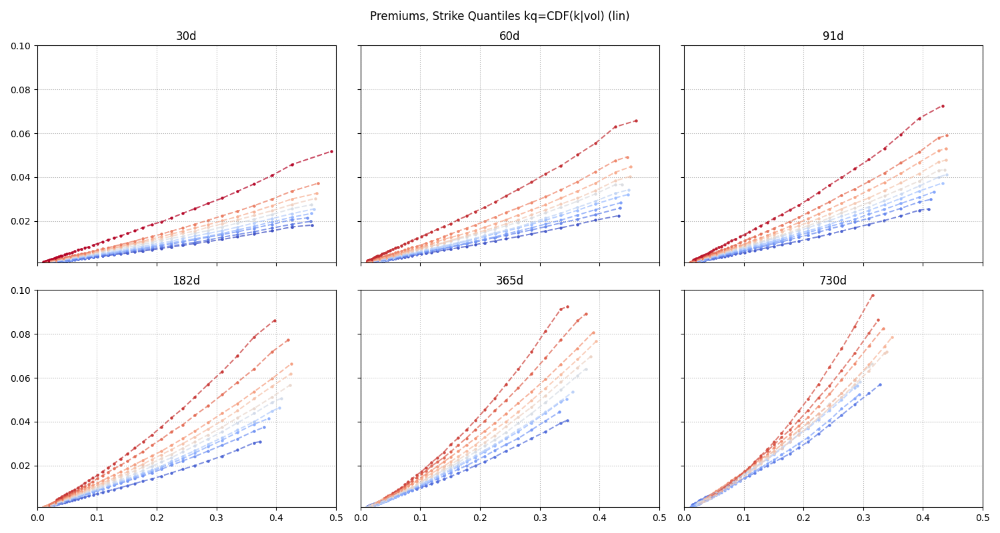

Premiums, Strike Quantiles kq=CDF(k|vol) (log)

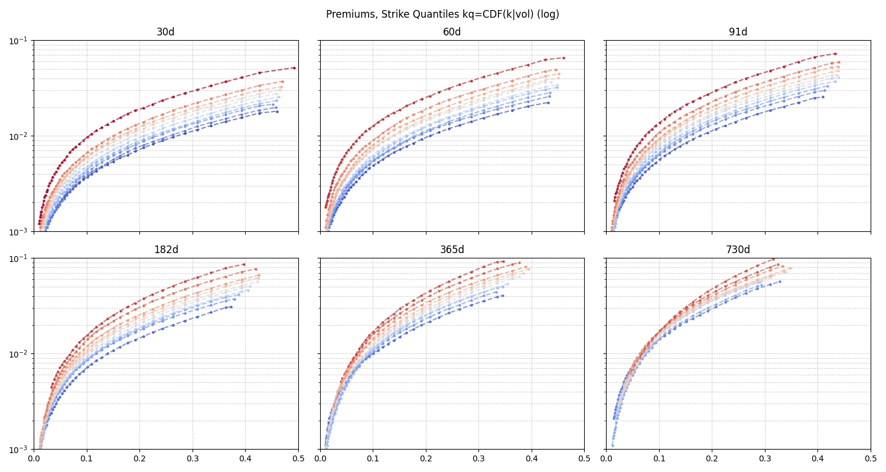

Premiums, Norm Strikes and Norm Premiums (lin)

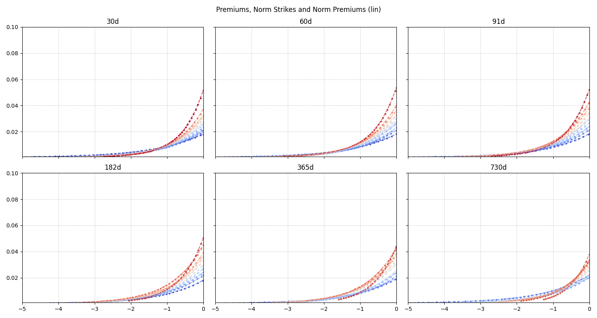

Premiums, Norm Strikes and Norm Premiums (log)

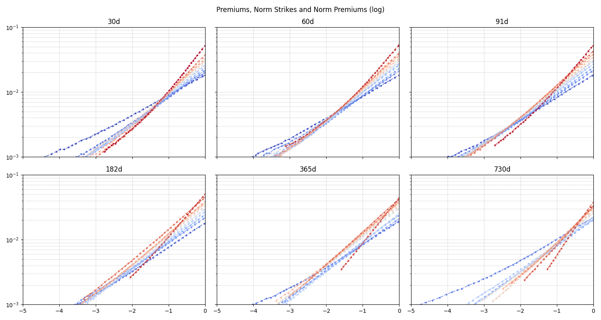

Ratio of Premium Min / Exp

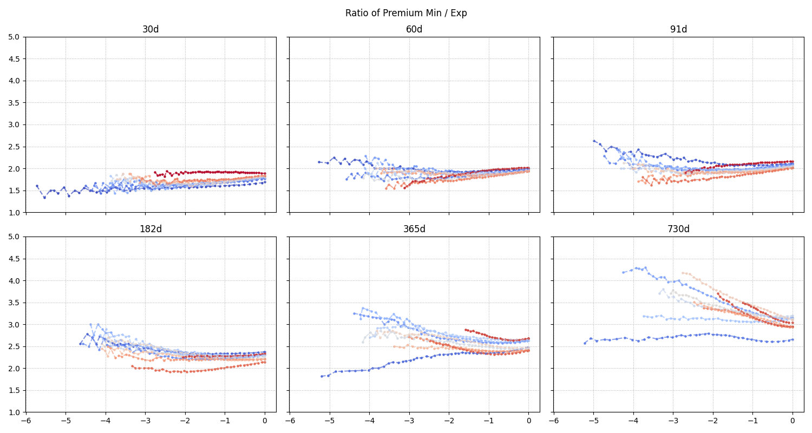

#note bounds for american put: eu < am < 2eu

### Data

    - period - period, days
    - vol - current volatility as std (in scale unit, not variance).
    - vol_dc - volatility decile 1..10
    - k - strike
    - kq - quantile or strike
    - p_exp - realised put premium using price at expiration (lower bound, european option)
    - p_min - realised put premium, using min price during option lifetime (upper bound, max possible
    for american option).

